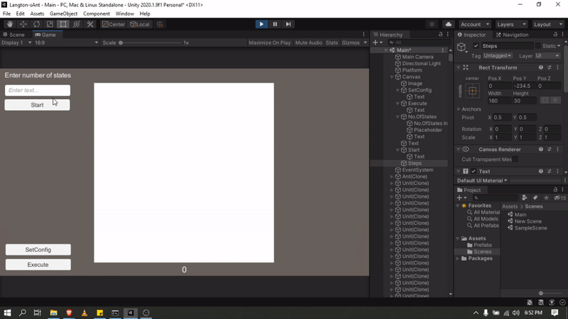

# Langton-sAnt
Implementation of Langton's Ant in unity.
Langton's ant can be described as a cellular automaton.

**Rules**
The "ant" moves according to the rules below:

1. At a white square, turn 90° clockwise, flip the color of the square, move forward one unit.
2. At a black square, turn 90° counter-clockwise, flip the color of the square, move forward one unit.

**Modes of behavior**
These simple rules lead to complex behavior. Three distinct modes of behavior are apparent,[3] when starting on a completely white grid.

1. Simplicity. During the first few hundred moves it creates very simple patterns which are often symmetric.
2. Chaos. After a few hundred moves, a large, irregular pattern of black and white squares appears. The ant traces a pseudo-random path until around 10,000 steps.
3. Emergent order. Finally the ant starts building a recurrent "highway" pattern of 104 steps that repeats indefinitely.

### Working Model

